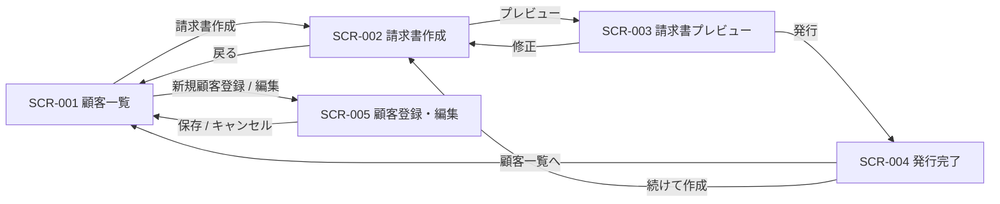

# 画面定義書（請求書発行システム）

対象コード: `Customer.java` / `InvoiceItem.java` / `CustomerRepository.java` / `InvoiceService.java`

## システム概要

顧客ごとに請求書を発行するシステムを Web アプリケーション化した場合の画面設計。
顧客を選択し、明細（品目・数量・単価）を入力すると、合計金額・消費税（10%）・税込合計を計算した請求書を発行する。

- 合計金額（税別） = 各明細の（数量 × 単価）の合計
- 消費税（10%） = 合計金額 × 0.1（円未満切り捨て）
- 税込合計 = 合計金額 + 消費税

## 画面一覧

| 画面ID | 画面名 | 説明 | 関連クラス |
|---|---|---|---|
| SCR-001 | 顧客一覧画面 | 登録済み顧客の一覧を表示する | `CustomerRepository`、`Customer` |
| SCR-002 | 請求書作成画面 | 顧客を選択し、明細を入力して請求書を作成する | `Customer`、`InvoiceItem`、`InvoiceService` |
| SCR-003 | 請求書プレビュー画面 | 発行前の請求書内容を確認する | `InvoiceService`、`InvoiceItem`、`Customer` |
| SCR-004 | 請求書発行完了画面 | 請求書の発行結果を表示する | `InvoiceService` |
| SCR-005 | 顧客登録・編集画面 | 顧客情報を新規登録・編集する | `CustomerRepository`、`Customer` |

## 画面遷移図

---

## SCR-001 顧客一覧画面

**画面概要**：登録済みの顧客を一覧表示る。ここから請求書の作成、または顧客の新規登録・編集へ進む入口となる。

### 表示項目

| 項目名 | 内容 | 備考 |
|---|---|---|
| 顧客ID | `Customer.customerId` | 例：`CUST-001` |
| 会社名 | `Customer.companyName` | 例：株式会社テックワーク |
| 請求先住所 | `Customer.billingAddress` | 例：東京都渋谷区1-1-1 |
| 登録件数 | 一覧の総件数 | |

### 入力項目

| 項目名 | 入力型 | 必須 | 備考 |
|---|---|:---:|---|
| 検索キーワード | テキストボックス | 任意 | 会社名・顧客IDの部分一致検索 |

### ボタン

| ボタン名 | 処理内容 | 遷移先 |
|---|---|---|
| 検索 | 検索キーワードで一覧を絞り込み再表示する | SCR-001（再表示） |
| 新規顧客登録 | 顧客の新規登録画面を開く | SCR-005 |
| 編集（各行） | 選択した顧客の編集画面を開く | SCR-005 |
| 請求書作成（各行） | 選択した顧客IDを引き継いで請求書作成画面を開く | SCR-002 |

### バリデーション

- 検索キーワード：任意。最大100文字。

---

## SCR-002 請求書作成画面

**画面概要**：請求先の顧客を選択し、請求明細（品目・数量・単価）を入力する。入力に応じて小計・合計・消費税・税込合計をリアルタイム計算して表示し、プレビュー画面へ進む。

### 表示項目

| 項目名 | 内容 | 備考 |
|---|---|---|
| 顧客ID | `Customer.customerId` | 選択した顧客の情報を表示 |
| 会社名 | `Customer.companyName` | |
| 請求先住所 | `Customer.billingAddress` | |
| 明細行番号 | 連番 | |
| 小計（各明細） | `InvoiceItem.calcSubtotal()`（数量 × 単価） | 入力に応じて自動計算 |
| 合計金額（税別） | 各明細の小計の合計 | 自動計算 |
| 消費税（10%） | 合計金額 × 0.1（円未満切り捨て） | 自動計算 |
| 税込合計 | 合計金額 + 消費税 | 自動計算 |

### 入力項目

| 項目名 | 入力型 | 必須 | 備考 |
|---|---|:---:|---|
| 請求先顧客 | ドロップダウン（登録済み顧客） | 必須 | SCR-001 から遷移した場合は選択済み |
| 請求日 | 日付ピッカー | 必須 | 既定値は当日 |
| 品目・摘要（明細） | テキストボックス | 必須 | `InvoiceItem.description`。1行以上 |
| 数量（明細） | 数値入力 | 必須 | `InvoiceItem.quantity`。1以上の整数 |
| 単価（明細） | 数値入力 | 必須 | `InvoiceItem.unitPrice`。0以上の整数（円） |
| 備考 | テキストエリア | 任意 | 請求書に付記する自由記述 |

### ボタン

| ボタン名 | 処理内容 | 遷移先 |
|---|---|---|
| 明細行を追加 | 明細入力行を1行追加する | SCR-002（遷移なし・再描画） |
| 明細行を削除 | 選択した明細行を削除する（最低1行は残す） | SCR-002（遷移なし・再描画） |
| クリア | 入力内容を初期状態に戻す | SCR-002（遷移なし・再描画） |
| プレビュー | 入力値を検証し、請求書内容をプレビュー表示する | SCR-003 |
| 戻る | 入力を破棄して顧客一覧へ戻る | SCR-001 |

### バリデーション

- 請求先顧客：必須。登録済み顧客から選択。
- 請求日：必須。日付形式（YYYY-MM-DD）。
- 明細：1行以上必須。
- 品目・摘要：必須。最大255文字。
- 数量：必須。半角数字のみ。1以上の整数（0・マイナス・小数不可）。
- 単価：必須。半角数字のみ。0以上の整数（マイナス・小数不可）。
- 金額上限：各明細の小計、および税込合計が桁あふれしないこと（例：小計は 999,999,999 円以内）。

---

## SCR-003 請求書プレビュー画面

**画面概要**：発行前の請求書を実際のレイアウトで確認する。内容に問題がなければ発行を確定し、修正が必要なら作成画面へ戻る。

### 表示項目

| 項目名 | 内容 | 備考 |
|---|---|---|
| 請求先会社名 | `Customer.companyName` | 「請求先：」として表示 |
| 請求先住所 | `Customer.billingAddress` | 「住所：」として表示 |
| 請求日 | SCR-002 で入力した請求日 | |
| 明細一覧 | 品目・摘要、数量、単価、小計 | 「1個 × 500,000円 ＝ 500,000円」形式 |
| 合計金額（税別） | 各明細の小計の合計 | |
| 消費税（10%） | 合計金額 × 0.1（円未満切り捨て） | |
| 税込合計 | 合計金額 + 消費税 | |
| 備考 | SCR-002 で入力した備考 | 入力時のみ表示 |

### 入力項目

なし（確認専用画面）。

### ボタン

| ボタン名 | 処理内容 | 遷移先 |
|---|---|---|
| 発行 | `InvoiceService#generateInvoice` を実行し、請求書を確定・保存する | SCR-004 |
| 修正 | 入力内容を保持したまま作成画面へ戻る | SCR-002 |
| 印刷／PDF出力 | プレビュー内容を印刷用に出力する | SCR-003（遷移なし） |

### バリデーション

- 入力チェックは SCR-002 で実施済み。
- 発行時にサーバー側で再検証し、顧客が存在しない・明細が0件などの場合はエラーとして SCR-002 へ戻す。

---

## SCR-004 請求書発行完了画面

**画面概要**：請求書の発行が完了したことを利用者に通知し、次の操作へ誘導する。

### 表示項目

| 項目名 | 内容 | 備考 |
|---|---|---|
| 完了メッセージ | 「請求書を発行しました」 | |
| 請求書番号 | 発行時に採番した番号 | |
| 請求先会社名 | `Customer.companyName` | |
| 請求日 | 発行した請求日 | |
| 税込合計 | 税込合計金額 | |

### 入力項目

なし。

### ボタン

| ボタン名 | 処理内容 | 遷移先 |
|---|---|---|
| 顧客一覧へ戻る | 顧客一覧画面へ戻る | SCR-001 |
| この請求書を表示 | 発行済み請求書の内容を表示する | SCR-003（確定版・読み取り専用） |
| 続けて請求書を作成 | 新しい請求書の作成を開始する | SCR-002 |

### バリデーション

なし。

---

## SCR-005 顧客登録・編集画面

**画面概要**：顧客情報を新規登録、または既存顧客の情報を編集する（`CustomerRepository#save`）。

### 表示項目

| 項目名 | 内容 | 備考 |
|---|---|---|
| 顧客ID | `Customer.customerId` | 編集時は表示のみ（変更不可） |

### 入力項目

| 項目名 | 入力型 | 必須 | 備考 |
|---|---|:---:|---|
| 顧客ID | テキストボックス | 必須（新規時のみ） | 例：`CUST-001`。編集時は変更不可 |
| 会社名 | テキストボックス | 必須 | `Customer.companyName` |
| 請求先住所 | テキストエリア | 必須 | `Customer.billingAddress` |

### ボタン

| ボタン名 | 処理内容 | 遷移先 |
|---|---|---|
| 保存 | 入力値を検証して顧客を登録・更新する | SCR-001 |
| キャンセル | 入力を破棄して一覧へ戻る | SCR-001 |

### バリデーション

- 顧客ID：必須。半角英数字とハイフンのみ。最大50文字。新規登録時は既存IDと重複不可。
- 会社名：必須。最大255文字。
- 請求先住所：必須。最大255文字。

---

## 補足

- SCR-004・SCR-005 は対象コード（`CustomerRepository#save`、`InvoiceService#generateInvoice` の発行完了）から必要と判断して追加した。
- 金額はすべて整数（円）で扱い、`InvoiceItem` の `quantity`・`unitPrice` が `int` であることに合わせる。
- 消費税は一律10%。現行コードに軽減税率の区分はないため、画面上も税率選択は設けない。
