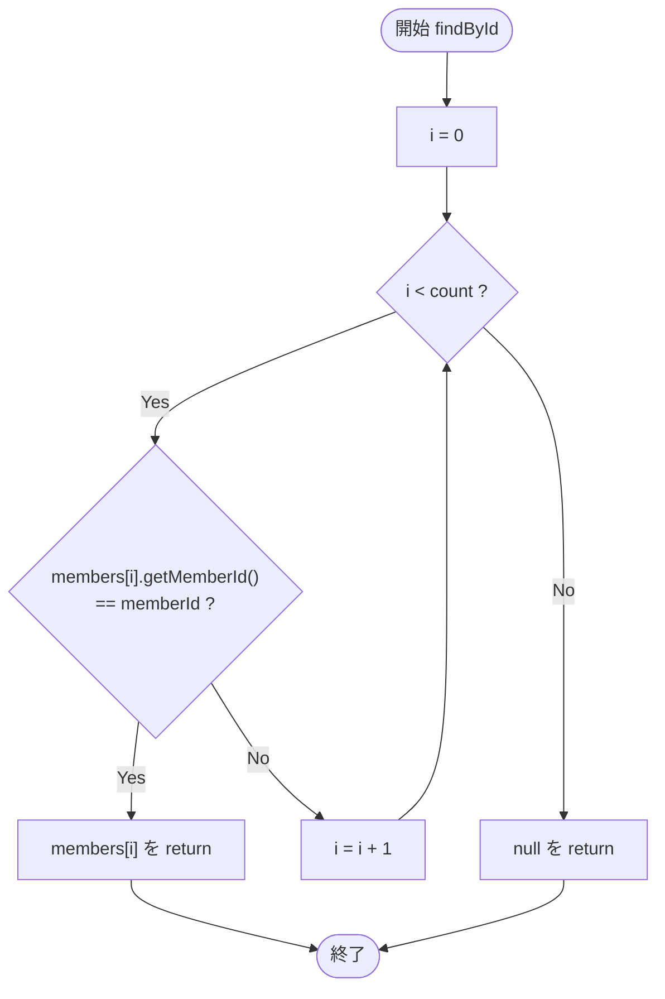
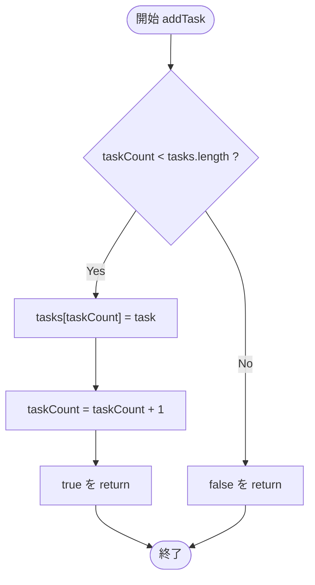
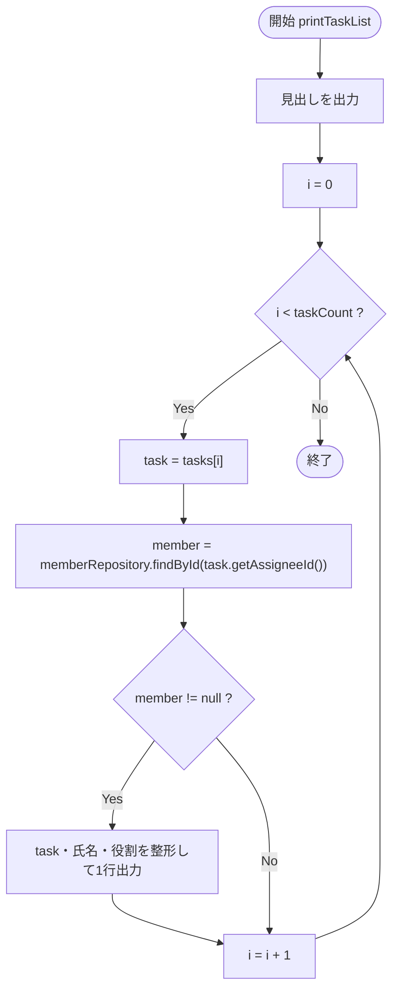

# 処理詳細設計書（タスク管理システム）

対象コード: `Task.java` / `MemberRepository.java` / `TaskService.java`

対象メソッド: `MemberRepository.findById` / `TaskService.addTask` / `TaskService.printTaskList`

---

## 1. MemberRepository.findById(String memberId)

### メソッド名

`MemberRepository.findById(String memberId)`

### 処理概要

保持しているメンバー配列 `members` を先頭から順に走査し、引数で指定されたメンバーIDと一致するメンバーを検索して返す。

### 引数

| 引数名 | 型 | 説明 |
|---|---|---|
| memberId | String | 検索対象のメンバーID |

### 戻り値

| 型 | 内容 |
|---|---|
| Member | 一致したメンバー。該当するメンバーが存在しない場合は `null` |

### 処理ステップ

1. `members` 配列を index `0` から `count - 1` まで順に走査する
2. `members[i].getMemberId()` が引数 `memberId` と一致するか判定する
   - 一致する場合 → `members[i]` を返して終了
   - 一致しない場合 → 次の要素へ（i を1つ進める）
3. 全件走査して一致しなかった場合 → `null` を返す

### フローチャート

### 例外・特記事項

- 対象メンバーが存在しない場合は `null` を返す（例外はスローしない）。呼び出し側で **null チェックが必須**（`TaskService.printTaskList` はこの前提で null を無視する実装になっている）。
- 走査範囲は `0 〜 count - 1` のみで、`members.length` までは走査しない。`count` を超える添字には未登録（未使用）の要素が残っている可能性があるため。
- 引数 `memberId` が `null` の場合、`members[i].getMemberId().equals(memberId)` 自体は `false` を返す比較になるため例外にはならず、結果として `null` が返る。

---

## 2. TaskService.addTask(Task task)

### メソッド名

`TaskService.addTask(Task task)`

### 処理概要

引数で受け取ったタスクを内部の `tasks` 配列に追加登録する。配列の上限（`tasks.length`）に達している場合は登録せず、失敗として扱う。

### 引数

| 引数名 | 型 | 説明 |
|---|---|---|
| task | Task | 登録するタスク |

### 戻り値

| 型 | 内容 |
|---|---|
| boolean | 登録に成功した場合 `true`、配列が満杯で登録できなかった場合 `false` |

### 処理ステップ

1. `taskCount`（現在の登録件数）が `tasks.length`（配列の上限）未満かどうかを判定する
   - 満たす場合（まだ空きがある）→ `tasks[taskCount]` に `task` を格納し、`taskCount` を1増やし、`true` を返して終了
   - 満たさない場合（上限に到達している）→ 何もせず `false` を返して終了

### フローチャート

### 例外・特記事項

- 配列の上限を超えて登録しようとしても **例外はスローされない**。戻り値 `false` で失敗を通知するのみのため、呼び出し側は必ず戻り値を確認する必要がある（確認を怠ると、登録できていないのに成功したものとして扱ってしまう）。
- 引数 `task` が `null` の場合でも配列への格納自体は成功し `true` が返る。後続処理（`printTaskList` など）で `task.getAssigneeId()` を呼び出す際に `NullPointerException` が発生するおそれがあるため、本来は呼び出し前提として `task != null` を保証すべき（現状の実装には null チェックなし）。
- 同一 `taskId` の重複登録チェックは行っていない（`taskId` の一意性は呼び出し側の責務）。

---

## 3. TaskService.printTaskList()

### メソッド名

`TaskService.printTaskList()`

### 処理概要

登録済みの全タスクについて、担当メンバーの氏名・役割を付与した一覧を標準出力へ表示する。担当メンバーが `MemberRepository` に存在しないタスクは表示対象から除外する。

### 引数

なし。

### 戻り値

| 型 | 内容 |
|---|---|
| void | 戻り値なし（標準出力への表示のみ） |

### 処理ステップ

1. 見出し `"===== タスク一覧 ====="` を出力する
2. `tasks` 配列を index `0` から `taskCount - 1` まで順に走査する
3. 各タスク `task` について、`task.getAssigneeId()` をキーに `memberRepository.findById(...)` で担当メンバーを検索する
   - メンバーが見つかった場合（`member != null`）→ `task.toDisplayString()`、`member.getMemberName()`、`member.getRole()` を整形し、1行として出力する
   - メンバーが見つからない場合（`member == null`）→ 何も出力せずスキップし、次のタスクへ
4. すべてのタスクを走査し終えたら処理を終了する

### フローチャート

### 例外・特記事項

- `findById` が `null` を返すタスク（担当メンバーがメンバー一覧に存在しない・`assigneeId` が誤っている等）は、**エラーにはならず一覧から無言で除外される**。担当者未登録に気づきにくい設計上の注意点であり、必要であれば「担当者未設定」等の代替表示を検討すべき箇所。
- `taskCount` が `0`（タスク未登録）の場合、見出しのみが出力され明細は1件も表示されない。
- 内部で例外（`NullPointerException` 等）は基本的に発生しない設計だが、`tasks[i]` 自体が `null`（`addTask(null)` が呼ばれていた場合）だと `task.getAssigneeId()` で `NullPointerException` が発生する。

---

## 補足

- 3メソッドとも配列を固定長で扱う実装（`Member[] members` / `Task[] tasks`）のため、上限判定（`count < 配列長`）が処理の重要な分岐点になっている。
- `findById` の「見つからなければ `null`」という戻り値の仕様が、`printTaskList` の「担当者不明タスクは表示しない」という挙動の直接の原因になっている（メソッド間の依存関係）。
