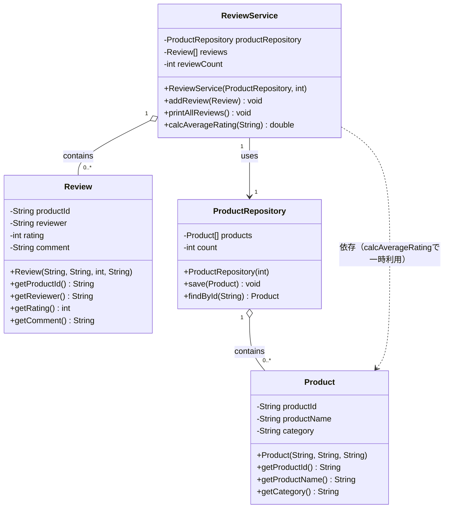

# UMLクラス図（商品レビューシステム）

対象コード: `Product.java` / `Review.java` / `ProductRepository.java` / `ReviewService.java`

作成ツール: Mermaid（`classDiagram`）

## クラス図

## クラス関係の一覧

| # | 関係元 | 関係先 | 種別 | 多重度 | 根拠（コード上の該当箇所） |
|---|---|---|---|---|---|
| 1 | `ProductRepository` | `Product` | 集約（◇--） | 1 対 0..* | フィールド `private Product[] products` として、複数の `Product` を保持・管理する |
| 2 | `ReviewService` | `Review` | 集約（◇--） | 1 対 0..* | フィールド `private Review[] reviews` として、複数の `Review` を保持・管理する |
| 3 | `ReviewService` | `ProductRepository` | 関連（実線矢印） | 1 対 1 | フィールド `private ProductRepository productRepository` として、単一のインスタンスを保持する（コンストラクタで注入） |
| 4 | `ReviewService` | `Product` | 依存（点線矢印） | （多重度なし） | フィールドとしては保持しない。`calcAverageRating(String productId)` の内部で `productRepository.findById(productId)` の戻り値 `Product` を一時的に利用する（商品の存在確認・平均評価計算のため）と想定されるため |

## 判別の考え方

- **`ProductRepository` → `Product`（集約）**：`Product[] products` という配列フィールドで「複数の部分（Product）をまとめて持つ」構造であり、`Product` は `ProductRepository` が消滅しても存在しうる（独立性が高い）ため、単純な関連ではなく集約とした。
- **`ReviewService` → `Review`（集約）**：`Review[] reviews` も同様に「複数の部分を持つ」構造のため集約とした。
- **`ReviewService` → `ProductRepository`（関連）**：フィールドとして保持してはいるが、1インスタンスを協調オブジェクトとして利用する関係であり、「部分をまとめて持つ」集約の意味合いは薄いため、単純な関連（実線矢印）とした。
- **`ReviewService` → `Product`（依存）**：`Product` をフィールドとして保持することはなく、`calcAverageRating` のようなメソッド内で `ProductRepository` 経由で一時的に取得・参照するにとどまるため、依存（点線矢印）とした。
- **`Review` と `Product` の間には直接の関係を引いていない**：`Review.productId` は `String` 型の外部キー相当のIDであり、`Product` オブジェクトそのものを参照していないため、クラス図上のオブジェクト参照関係（関連・集約・依存）としては表現していない。

## クラス一覧（補足）

| クラス | 役割 |
|---|---|
| `Product` | 商品情報（商品ID・商品名・カテゴリ）を保持するエンティティ |
| `Review` | レビュー情報（対象商品ID・レビュアー・評価・コメント）を保持するエンティティ |
| `ProductRepository` | `Product` を配列で保持し、登録（`save`）・ID検索（`findById`）を行うリポジトリ |
| `ReviewService` | `Review` を配列で保持し、登録（`addReview`）・一覧表示（`printAllReviews`）・平均評価計算（`calcAverageRating`）を行うサービス。商品情報の参照に `ProductRepository` を利用する |

## 補足・前提

- コード中の `...` で省略されているコンストラクタ・メソッド本体は、フィールド定義とメソッドシグネチャから実装内容を推測して図示・関係付けを行いました。（特に `calcAverageRating` 内部での `ProductRepository` 利用は、シグネチャと役割から妥当と判断した想定）。
- アクセス修飾子はコード上で `private` フィールド・`public` メソッドとして明示されているとおり、`-` / `+` で表現しました。
- 配列で複数件を保持するフィールド（`Product[] products`、`Review[] reviews`）は、要素数の上限を持つ固定長配列だが、UML上の多重度としては「0..*（0件以上）」として表現しました。